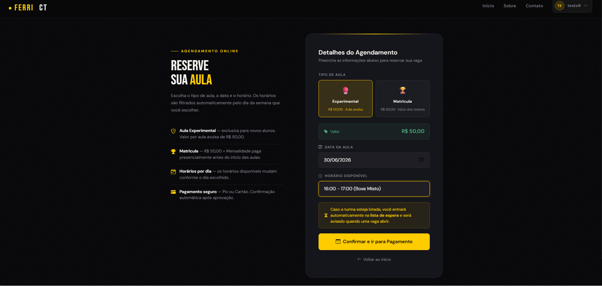
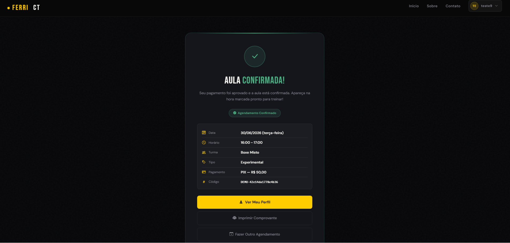
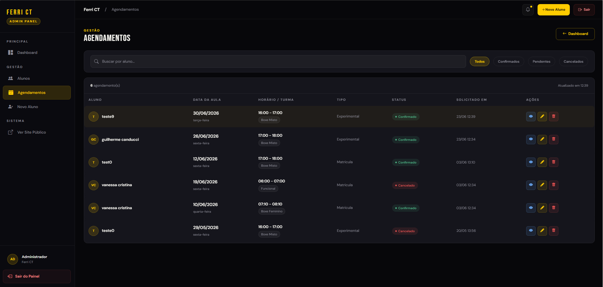

# Sistema Web de Agendamento — Ferri CT

Sistema web de agendamento da academia **Ferri CT** (Presidente Prudente/SP). Fluxo de pagamento simulado (sem gateway real nessa branch de apresentação acadêmica).

**Stack:** ASP.NET MVC 5 (.NET Framework 4.7.2) + Entity Framework 6 (Code First com Migrations) + SQL Server LocalDB + Razor Views + Bootstrap.

---

## Pré-requisitos

| Software | Versão mínima | Observação |
|---|---|---|
| **Windows** | 10 ou 11 | Necessário para .NET Framework |
| **Visual Studio** | 2019 ou 2022 | Community Edition serve. Com workload "ASP.NET e desenvolvimento web" |
| **.NET Framework** | 4.7.2 | Já vem no Windows 10/11 atualizado |
| **SQL Server LocalDB** | 2019+ | Instala junto com Visual Studio (workload de dados) |

---

## Como rodar (passo a passo)

### 1. Clonar o repositório

```powershell
git clone https://github.com/<seu-usuario>/SistemaWebAgendamentoFerriCT.git
cd SistemaWebAgendamentoFerriCT
```

### 2. Restaurar pacotes NuGet

No Visual Studio, abra `SistemaWebAgendamentoFerriCT.sln`. O VS restaura os pacotes automaticamente ao abrir a solução. Se der erro, no menu: **Tools → NuGet Package Manager → Restore NuGet Packages**.

### 3. Compilar (Ctrl+Shift+B)

A primeira compilação demora um pouco (resolve dependências).

### 4. Rodar (F5)

Na primeira execução:
- O Entity Framework cria automaticamente o banco SQL LocalDB (`SistemaWebAgendamentoFerriCT`)
- Aplica todas as migrations
- Roda o seed (popula professores, turmas, horários e 2 clientes de demo)

A aplicação abre em `https://localhost:44358`.

---

## Credenciais de demo

### Cliente (login por Email + CPF)

| Nome | Email | CPF |
|---|---|---|
| Cliente Demo | `demo@ferrict.com.br` | `529.982.247-25` |
| Maria Aluna | `maria@ferrict.com.br` | `111.444.777-35` |

### Admin

- URL: `https://localhost:44358/Admin/Login`
- Usuário: `admin`
- Senha: `123`

⚠️ A senha do admin é hardcoded e só serve pra demo acadêmica. Em produção real, deveria estar em config externo com hash bcrypt/Argon2.

---

## Fluxo de pagamento (simulado)

Essa branch não usa gateway de pagamento real. O fluxo é simulado pra fins de apresentação:

- **Cliente:** ao criar agendamento, escolhe forma de pagamento (PIX ou Débito) na tela `Agendamento/Pagamento`. Ao confirmar, é registrado um `Pagamento` aprovado com `CodigoTransacao = "DEMO-{Guid}"` e o agendamento vai pra `Confirmado`.
- **Admin:** pode registrar pagamento recebido no balcão (dinheiro, PIX direto, débito presencial) pelo painel, em `Detalhes do Agendamento → Registrar Pagamento Manual`. Gera `CodigoTransacao = "MANUAL-{Guid}"`.
- **Valores:** recalculados sempre server-side a partir do `TipoAula`. Cliente/form nunca informa valor.
- **Timeout:** agendamentos parados em `PendentePagamento` por mais de 1h são cancelados automaticamente pelo `AgendamentoCleanupJob`.

---

## Estrutura do projeto

```
SistemaWebAgendamentoFerriCT/
├── Controllers/
│   ├── HomeController.cs
│   ├── ClienteController.cs       (login, cadastro, perfil)
│   ├── AdminController.cs         (painel admin)
│   └── AgendamentoController.cs   (agendar, pagamento simulado)
├── Models/                        (entidades EF Code First)
├── ViewModels/                    (DTOs pra views)
├── Views/                         (Razor)
├── Migrations/                    (EF migrations + Configuration.cs com seed)
├── Filtros/
│   └── FiltroAcesso.cs            (action filter pra admin)
├── Tasks/
│   └── AgendamentoCleanupJob.cs   (cancela agendamentos com timeout 1h)
└── Web.config                     (config geral)
```

---

## Regras de negócio principais

### Agendamento

- Academia **fechada aos domingos** e em feriados (fixos + móveis via algoritmo de Páscoa).
- Cliente só pode ter 1 agendamento ativo por (data, horário).
- Aula **Experimental** é exclusiva para clientes sem agendamento prévio.
- Turmas não têm capacidade máxima — não há lista de espera.

### Pagamento

- Métodos aceitos no fluxo simulado: **PIX** e **Débito** (escolhidos pelo cliente na tela de pagamento)
- Admin pode registrar pagamento manual recebido no balcão (Dinheiro, PIX, Débito)
- Timeout de pendente: **1h** → cancela automaticamente e libera vaga
- Pagamento manual gera `CodigoTransacao = "MANUAL-{Guid}"`; pagamento simulado pelo cliente gera `CodigoTransacao = "DEMO-{Guid}"`
- Máximo 1 agendamento `PendentePagamento` por cliente
- Valor recalculado sempre server-side

### Estados de agendamento

```
PendentePagamento ─┬─► Confirmado (pagamento simulado pelo cliente)
                   ├─► Confirmado (pagamento manual pelo admin)
                   └─► Cancelado (timeout 1h ou admin)
```

---

## Defesas de segurança implementadas

- Senha do cliente armazenada como **SHA-256 + salt**
- Todas as actions POST protegidas por `[ValidateAntiForgeryToken]`
- **Ownership check** em endpoints de pagamento (cliente A não acessa pagamento de B)
- Guard "1 `PendentePagamento` por cliente"
- Valor de cada agendamento **recalculado server-side** a partir do `TipoAula` (form/URL não confiável)
- Whitelist explícita de formas de pagamento aceitas (Dinheiro/PIX/Débito no manual; PIX/Débito no simulado)
- Cleanup automático de agendamentos abandonados após 1h

---

## Documentos relacionados

- **`HANDOFF.md`** — estado atual do trabalho, decisões técnicas e dívidas conhecidas
- **`CLAUDE.md`** — instruções pro assistente de IA (Claude Code) que ajuda no desenvolvimento

---

## Comandos úteis

```powershell
# Restaurar pacotes NuGet (linha de comando)
nuget restore

# No Package Manager Console do Visual Studio:
Update-Database              # aplica migrations + roda seed
Add-Migration NomeMigration  # cria nova migration
```

---

## Solução de problemas

| Sintoma | Causa provável | Solução |
|---|---|---|
| Erro de build "metadata file not found" | Pacotes NuGet não restaurados | Restore manual no menu do VS |
| "Cannot open database" | LocalDB não instalado | Reinstalar SQL Server LocalDB |
| `AutomaticMigrationsDisabledException` no startup | Modelo EF divergente do snapshot | Rodar `Add-Migration NomeDescritivo` no Package Manager Console e dar F5 de novo |
| Caracteres acentuados aparecem como `á` | Arquivo `.cshtml` salvo sem BOM UTF-8 | Reabrir e salvar como "UTF-8 with BOM" no VS |

---

## Screenshots

| Home | Agendamento |
|------|-------------|
|  |  |

| Confirmação | Painel Admin |
|-------------|-------------|
|  |  |

---

## Licença

Projeto acadêmico — sem licença pública definida.
